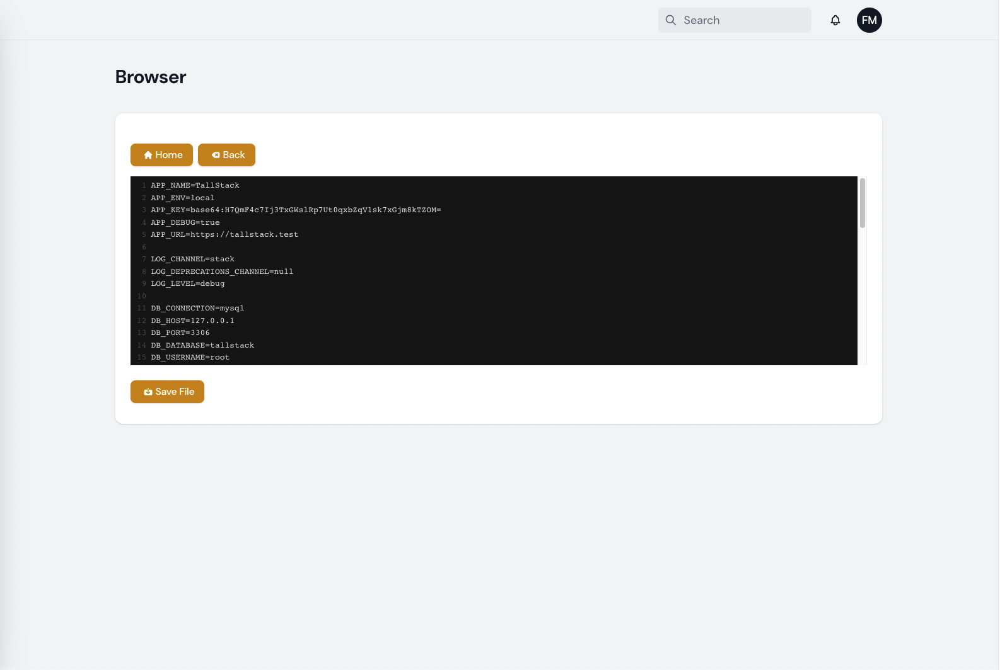

# Filament Browser

File & Folders & Media Browser With Code Editor

## Features

- File Browser
- Code Editor with highlights
- Media Viewer
- .Env Editor

## Screenshots





## Installation

You can install the package via composer:

```bash
composer require 3x1io/filament-browser
```


Then publish the assets:

```bash
php artisan vendor:publish --tag="filament-browser-js"
```

and now clear cache

```bash
php artisan route:clear
```

```bash
php artisan view:clear
```

```bash
php artisan optimize:clear
```


## Changelog

Please see [CHANGELOG](CHANGELOG.md) for more information on what has changed recently.

## Credits

- [3x1](https://github.com/3x1io)

## License

The MIT License (MIT). Please see [License File](LICENSE.md) for more information.
